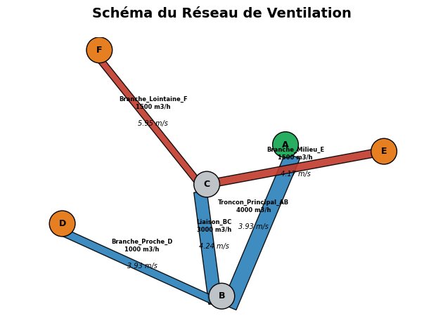

# HVAC Network Solver

>**HVAC Network Solver** est un moteur de calcul aéraulique basé sur une modélisation de réseau nodal non linéaire.
Il permet le **dimensionnement**, **l’équilibrage** et **l’analyse énergétique** de réseaux de ventilation à partir d’une description géométrique simple.


---

## 💡 Contexte

Les outils HVAC classiques sont souvent :

- propriétaires et fermés
- peu transparents sur les modèles physiques
- difficiles à automatiser dans des workflows numériques

Ce projet propose une alternative :

- open-source
- basée sur un modèle physique explicite simplifié
- exploitable via API (Python / simulation / optimisation)

---

## 🎯 Cas d’usage

- Pré-dimensionnement de réseaux de ventilation
- Vérification des pertes de charge
- Analyse énergétique de systèmes aérauliques
- Simulation de réseaux de désenfumage
- Support bureau d’études CVC / énergie

---

## 🚀 Fonctionnalités

- Solveur nodal non linéaire (équilibrage automatique des débits)
- Modélisation des pertes de charge (linéaires + singulières)
- Support géométrie circulaire et rectangulaire
- Estimation puissance ventilateur
- Calcul coût énergétique annuel
- Visualisation automatique du réseau (Graph + géométrie)
- API FastAPI (intégration Python / industrialisation)

---

## 🧠 Modèle physique

Le solveur repose sur une **modélisation réseau simplifiée non linéaire**, adaptée au pré-dimensionnement HVAC. IL repose sur les principes fondamentaux de la mécanique des fluides :

### 1. Conservation de la masse (nœuds)

À chaque nœud du réseau :

<p align="center">
  <b>Σ Q = S</b>
</p>

- S > 0 : soufflage
- S < 0 : extraction
- S = 0 : simple transit

### 2. Pertes de charge (Darcy–Weisbach)

<p align="center">
  <b>ΔP = [ f · (L/D) + Σζ ] · (ρ · v²) / 2</b>
</p>

Où :
*   **f** : Facteur de friction (Darcy)
*   **L** : Longueur du conduit (m) 
*   **D** : Diamètre hydraulique (m)
*   **Σζ** : Somme des coefficients de pertes singulières (coudes, tés, registres)
*   **ρ** : Masse volumique de l’air (~1.204 kg/m³)
*   **v** : Vitesse de l’air (m/s)

### 3. Formulation réseau (modèle résistif)

Chaque conduit est modélisé sous la forme :

<p align="center">
  <b>ΔP = R · Q²</b> 
  &nbsp;&nbsp;&nbsp;&nbsp;&nbsp;&nbsp;&nbsp;&nbsp; avec &nbsp;&nbsp;&nbsp;&nbsp;&nbsp;&nbsp;&nbsp;&nbsp; 
  <b>R = [ f · (L/D) + Σζ ] · [ ρ / (2 · S²) ]</b>
</p>


*   **Q** : Débit volumique (m³/s)
*   **S** : Section du conduit (m²)
*   **R** : résistance aéraulique

### 4. Relation débit–pression (inverse)

<p align="center">
  <b>Q = sign(ΔP) · √( |ΔP| / R )</b> 
</p>

---

## ⚙️ Méthode numérique

Le solveur repose sur une relaxation nodale itérative :

1. Initialisation des pressions nodales  
2. Calcul des débits via Q(ΔP)  
3. Calcul des déséquilibres de continuité aux nœuds  
4. Mise à jour des pressions :

<p align="center">
  <b>P(k+1) = P(k) + α · imbalance</b> 
</p>

- α : facteur de relaxation (stabilité numérique)

---

## 🔍 Hypothèses
- écoulement incompressible
- régime permanent
- facteur de friction constant
- pertes singulières regroupées en ζ
- pas de dynamique transitoire
- pas de courbe ventilateur intégrée

---

## 📖 API

Swagger : [`http://127.0.0.1:8000/docs`](http://127.0.0.1:8000/docs)

### Endpoints

| Méthode | Route | Description |
|--------|------|------------|
| POST | /network/init | reset réseau |
| POST | /network/nodes | ajout nœuds |
| POST | /network/ducts | ajout conduits |
| GET  | /network/solve | résolution réseau |
| GET  | /network/visualize | schéma réseau |


---

## 🏗️ Exemple 

### Nœuds

```json
[
  {"name": "A", "supply": 4000},
  {"name": "B", "supply": 0},
  {"name": "C", "supply": 0},
  {"name": "D", "supply": -1000},
  {"name": "E", "supply": -1500},
  {"name": "F", "supply": -1500}
]
```

### Conduits

```json
[
  {
    "name": "Troncon_Principal_AB",
    "n1": "A",
    "n2": "B",
    "L": 5,
    "D": 0.6,
    "coeffs": [0.3]
  },
  {
    "name": "Liaison_BC",
    "n1": "B",
    "n2": "C",
    "L": 8,
    "D": 0.5,
    "coeffs": [0.3]
  },
  {
    "name": "Branche_Proche_D",
    "n1": "B",
    "n2": "D",
    "L": 2,
    "D": 0.3,
    "coeffs": [1.5]
  },
  {
    "name": "Branche_Milieu_E",
    "n1": "C",
    "n2": "E",
    "L": 10,
    "W": 0.4,
    "H": 0.25,
    "coeffs": [1.5]
  },
  {
    "name": "Branche_Lointaine_F",
    "n1": "C",
    "n2": "F",
    "L": 25,
    "W": 0.35,
    "H": 0.2,
    "coeffs": [2.0]
  }
]
```

### Solve 

```json
{
  "summary": {
    "total_flow_m3h": 4000,
    "max_pressure_drop_pa": 95.3,
    "fan_power_watts": 151.27,
    "estimated_annual_cost_euros": 94.54,
    "efficiency_used": 0.7
  },
  "results": [
    {
      "duct": "Troncon_Principal_AB",
      "flow_m3h": 4000,
      "delta_p_pa": 4.32,
      "velocity_ms": 3.93
    },
    {
      "duct": "Liaison_BC",
      "flow_m3h": 3000,
      "delta_p_pa": 6.7,
      "velocity_ms": 4.24
    },
    {
      "duct": "Branche_Proche_D",
      "flow_m3h": 1000,
      "delta_p_pa": 15.13,
      "velocity_ms": 3.93
    },
    {
      "duct": "Branche_Milieu_E",
      "flow_m3h": 1500,
      "delta_p_pa": 22.4,
      "velocity_ms": 4.17
    },
    {
      "duct": "Branche_Lointaine_F",
      "flow_m3h": 1500,
      "delta_p_pa": 84.27,
      "velocity_ms": 5.95
    }
  ]
}
```
👉 Lecture ingénieur
- continuité respectée
- la branche la plus résistante impose la pression système
- la dernière branche conditionne le dimensionnement ventilateur
- vérification des vitesses pour confort / acoustique

### Visualisation

<p align="center">


👉 Lecture :
- bleu : circulaire
- gris : rectangulaire
- épaisseur = débit

---

## 🔥 Roadmap
- Solveur Newton-Raphson (niveau industriel)
- Courbes ventilateur (Q–ΔP)
- Export Excel / PDF
- Interface web (dashboard CVC)
- Optimisation automatique réseau

---

## ⚠️ Disclaimer

Outil de pré-dimensionnement uniquement.
Ne remplace pas une étude CFD ou une validation réglementaire.

---

## 📁 Structure du projet
```text
hvac-network-solver/
│
├── README.md                                       # Documentation principale
├── LICENSE                                         # Licence MIT                          
├── requirements.txt                                # Dépendances Python 
├── main.py                                         # API FastAPI
├── network.py                                      # Solveur réseau
├── calculs.py                                      # Modèle physique
│
├── docs/
│   └── demo.png                                    # Image démo
│
└── .gitignore                                      # Fichiers à exclure

```
---
## 🛠️ Installation

```bash
# Cloner le dépôt
git clone https://github.com/FatehChaabat/hvac-network-solver.git
cd hvac-network-solver

# Installer les dépendances
pip install -r requirements.txt

# Lancer le serveur
uvicorn main:app --reload    

```

---
## 👤 Auteur
Ingénieur en mécanique des fluides et énergétique, spécialisé en modélisation et systèmes CVC.

[](https://fatehchaabat.github.io)
[](https://www.linkedin.com/in/fateh-chaabat-08202aa9/)
[](https://github.com/FatehChaabat)
[](https://www.researchgate.net/profile/Fateh-Chaabat-2)

---

## 📄 Licence
MIT License
