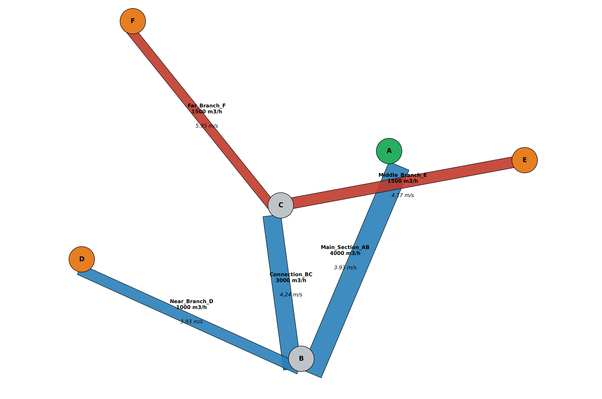

# HVAC Network Solver API

> **Moteur de calcul aéraulique haute performance** dédié au dimensionnement et à l'équilibrage dynamique de réseaux CVC complexes. Développé avec une architecture API-First (FastAPI), il automatise la résolution physique non linéaire par une approche nodale rigoureuse pour garantir une précision industrielle et une efficience énergétique optimale.


---

## 💡 Valeur Ajoutée pour l'Ingénierie

- **Rigueur physique** : Modèles explicites et validés (Darcy-Weisbach, Colebrook-White, Sutherland, Idelchik, Borda-Carnot, Bernoulli généralisé).
- **Fiabilité** : Solveur à haute précision (résidu $< 10^{-9}$ m³/s) respectant strictement la conservation des masses (Loi de Kirchhoff).
- **Universalité** : Supporte nativement les topologies mono et multi-ventilateurs, en soufflage et en extraction, avec détection automatique du mode opératoire.
- **Automatisation** : Du dimensionnement des conduits à la génération de rapports techniques complets au format PDF.
- **Flexibilité** : API REST scalable, prête pour l'intégration dans des workflows BIM, jumeaux numériques ou logiciels de CAO.

---

## 🚀 Fonctionnalités Clés


- **Simulation Multi-Régimes** : Calcul des pertes de charge (frottements et singularités) via la résolution exacte de **Colebrook-White** par bisection, adaptée à chaque conduit selon sa rugosité et son régime d'écoulement.
- **Solveur Nodal Non Linéaire** : Équilibrage automatique des débits par méthode itérative de relaxation nodale avec facteur adaptatif anti-oscillation.
- **Singularités Dynamiques Avancées** : Calcul automatique des pertes de charge des tés (Idelchik) avec détection locale du type de jonction, et des transitions convergent/divergent (Idelchik, Borda-Carnot pondéré) affectées sur la section de référence correcte.
- **Dimensionnement Multi-Ventilateurs** : Circuit critique, pression totale et puissance calculés individuellement par ventilateur (rendement propre), avec table d'équilibrage hydraulique par terminal.
- **Analyse Énergétique** : Estimation de la puissance électrique réelle absorbée (Bernoulli généralisé, méthodes B/C Almeco/AMCA) et calcul du coût d'exploitation annuel (OPEX).
- **Rapports PDF Professionnels** : Génération automatisée d'un document technique structuré incluant bilans aérauliques, audit hydraulique, analyse acoustique et recommandations de redimensionnement.
- **Assistant de Design** : Module autonome de prédimensionnement des conduits circulaires et rectangulaires selon des cibles de vitesse et de débit *(Voir [l'annexe technique](#duct-sizer))*.

---

## 🔬 Méthodologie de Calcul & Ingénierie Physique

Le moteur transforme la topologie physique du réseau en un système d'équations non linéaires, résolu par itérations successives jusqu'à l'équilibre parfait des flux.

### 1. Physique des Fluides & Propriétés Dynamiques

Le solveur adapte ses calculs aux conditions réelles de l'installation :

**Propriétés de l'air :** Calcul dynamique de la masse volumique ($\rho$) via la **loi des gaz parfaits** couplée au modèle atmosphérique standard ISA, et de la viscosité dynamique ($\mu$) via l'équation de **Sutherland** — en fonction de la température ($T$) et de l'altitude du site ($z$).

$$\rho = \frac{P_{atm}(z)}{R_{air} \cdot T} \qquad et \qquad \mu = \mu_0 \left(\frac{T}{T_0}\right)^{3/2} \frac{T_0 + S}{T + S}$$

> * $$P_{atm}(z) = 101325.0 \cdot (1.0 - 2.25577 \times 10^{-5} \cdot \text z)^{5.25588}$$.
> * $R_{air} = 287.05 \ \text{J/(kg}\cdot\text{K)}$ &nbsp; | &nbsp; $\mu_0 = 1.716 \times 10^{-5} \ \text{Pa}\cdot\text{s}$ &nbsp; | &nbsp; $S = 110.4 \ \text{K}$ &nbsp; | &nbsp; $T_0 = 273.15 \ \text{K}$ &nbsp; | &nbsp; $T = (T_{temp\textunderscore c} + T_0) \ \text{K}$.

**Friction de haute précision :** Utilisation de **Darcy-Weisbach** couplée à la résolution exacte de **Colebrook-White** par méthode de **bisection** (convergence garantie, précision $< 10^{-10}$) pour le régime turbulent, et de **Poiseuille** ($\lambda = 64/Re$) pour le régime laminaire :

$$\Delta P = \left( \lambda \cdot \frac{L}{D_h} + \Sigma\zeta \right) \cdot \frac{\rho \cdot v^2}{2} \qquad et \qquad \frac{1}{\sqrt{\lambda}} = -2\log_{10}\left(\frac{\varepsilon/D_h}{3.7} + \frac{2.51}{Re\sqrt{\lambda}}\right)$$


### 2. Résistance Aéraulique ($R$)

Le moteur condense les propriétés physiques et géométriques en une **résistance aéraulique** $R$ (Pa·s²/m⁶), réévaluée dynamiquement à chaque itération :

$$R = \left( \lambda \cdot \frac{L}{D_h} + \Sigma\zeta \right) \cdot \frac{\rho}{2 \cdot A^2} \qquad \Rightarrow \qquad \Delta P = R \cdot Q^2$$

Cette analogie avec les circuits électriques (loi d'Ohm non linéaire) garantit une fidélité physique supérieure aux modèles à résistance fixe.


### 3. Formulation par Conductance ($C$)

Pour optimiser la stabilité numérique du solveur, la résistance $R_d$ est convertie en **conductance aéraulique** $C_d = 1 / \sqrt{R_d}$, définissant la capacité du conduit $d$ à laisser passer le flux pour une différence de pression donnée :

$$Q_d = \text{sign}(\Delta P_d) \cdot C_d \cdot \sqrt{|\Delta P_d|} \qquad \text{et} \qquad Imb_n = S_n + \sum Q_{d, \text{entrants}} - \sum Q_{d, \text{sortants}}$$

<br>

  > * **$\Delta P_d$** : Différence de pression du conduit $d$ ($P_{amont} - P_{aval}$).
  > * **$S_n$** : Contrainte de débit imposée au nœud $n$ (Injection $>0$, Extraction $<0$, Transit $=0$).
  > * **$Imb_n$** : Résidu de flux. Si **$Imb_n \neq 0$**, le nœud $n$ est en déséquilibre et sa pression doit être ajustée. 

La correction de pression est calculée par ajustement itératif (linéarisation de Newton-Raphson) via la conductance totale des conduits $d$ connectés au nœud $n$ pour satisfaire la **loi de conservation de la masse** (Kirchhoff) :

$$P_{n, \text{nouveau}} = P_{n, \text{ancien}} + w \cdot \frac{Imb_n}{\displaystyle\sum_{d \in n} (0.5 \cdot C_d / \sqrt{|\Delta P_d|})}$$

> * **$w$ :** Facteur de relaxation adaptatif ($0.02 \le w \le 0.3$).
> * **Convergence :** Le processus itère jusqu'à ce que $Imb_{max} < 10^{-9} \ \text{m}^3/\text{s}$ (soit $0.0036 \ \text{l/h}$).

### 4. Solveur Nodal : Stratégie de Convergence en Deux Phases

Pour garantir robustesse et précision sur tous types de topologies, le solveur adopte une stratégie en deux phases distinctes :

#### Phase 1 — Convergence Primaire (Frottement Linéaire Pur et Singularités Constantes)
Le solveur converge sans singularités dynamiques (tés, transitions). Cela garantit une base de débits stables et évite les oscillations précoces.

#### Phase 2 — Activation des Singularités Dynamiques
Dès qu'une pré-convergence est atteinte ($Imb < 10^{-3} \text{ m}^3/\text{s}$), les singularités dynamiques sont injectées pour la convergence finale de haute précision ($< 10^{-9}$ m³/s).

### 5. Calcul Physique des Singularités

#### 5.1 Transitions Convergent / Divergent (Idelchik Ch.5)

Appliquées uniquement aux jonctions simples (2 conduits) — les tés sont exclus pour éviter tout double comptage. Le type de transition est détecté automatiquement selon le sens réel du flux (soufflage ou extraction) :

- **Convergent** : $\zeta = \zeta_{fr} + \zeta_{loc}$ (frottement Idelchik 5.6 + perte locale 5.23)
- **Divergent** : $\zeta = k(\alpha) \cdot (1-\beta)^2$ (Borda-Carnot pondéré, Idelchik/Miller)

Le ζ est toujours affecté sur la petite section (référence Idelchik). 

#### 5.2 Tés Dynamiques (Idelchik Ch.7)

Le type de jonction (**division** ou **confluence**) est détecté localement selon la direction du tronc commun au nœud — indépendamment du mode global soufflage/extraction :

- **Division** : $\zeta_b = 1 + v_r^2 - 2x$ ; $\zeta_s = 0.4(1-x)^2$
- **Confluence** : $\zeta_b = 1 + v_r^2 - 2(1-x)$ ; $\zeta_s = 0.1(1-x)^2$

Les ζ sont convertis depuis la vitesse du tronc commun vers la vitesse locale de chaque conduit via le rapport $\left(\frac{v_{commun}}{v_{local}}\right)^2$.

Les **ζ négatifs** (gain d'inertie) sont isolés et appliqués en post-traitement sans déstabiliser le solveur.

### 6. Analyse du Chemin Critique & Dimensionnement Ventilateur

#### 6.1 Identification par Ventilateur (Dijkstra)

Pour chaque ventilateur, l'algorithme de **Dijkstra** identifie le circuit le plus résistant parmi toutes ses bouches terminales. Les pertes statiques sont calculées par sommation directe sur le chemin physique, intégrant frottements et singularités.

#### 6.2 Formule de Bernoulli Généralisée

Conforme à la classification **Almeco/AMCA** (méthodes B et C) :

$$\boxed{\Delta P_{ventilateur} = \sum \Delta P_{pertes} + \frac{\rho\ \cdot V_{bouche}^2}{2}}$$

Valable en **soufflage** (entrée libre, sortie raccordée) et en **extraction** (entrée raccordée, sortie libre) — la pression dynamique d'aspiration est implicitement gérée par la courbe fabricant dans les deux cas.

#### 6.3 Dimensionnement Individuel Multi-Ventilateurs

La puissance absorbée et le coût d'exploitation sont calculés pour chaque ventilateur via son rendement $\eta_i$ :

$$\dot{W}_{fan,i} = \frac{\Delta P_{tot,i} \cdot Q_i}{\eta_i} \qquad \text{et} \qquad \dot{W}_{total} = \sum_i \dot{W}_{fan,i}$$

---

## 📖 Documentation API

L'API intègre nativement deux interfaces de documentation automatique conformes au standard **OpenAPI 3.1**.

*   **Swagger UI** : Interface interactive permettant de tester chaque endpoint.
    > Accessible via : [`http://127.0.0.1:8000/docs`](http://127.0.0.1:8000/docs)

*   **ReDoc** : Documentation structurée, idéale pour une lecture approfondie des modèles de données.
    > Accessible via : [`http://127.0.0.1:8000/redoc`](http://127.0.0.1:8000/redoc)

---

## 🔌 Endpoints de l'API
Le tableau suivant récapitule toutes les routes du moteur de calcul :

### 📋 API du Solveur Aéraulique

| Méthode | Route | Description | Format |
| :--- | :--- | :--- | :--- |
| `GET` | `/system/info` | Diagnostic du système | JSON |
| `POST` | `/network/reset` | Réinitialisation complète du moteur | JSON |
| `POST` | `/project/info` | Configuration des métadonnées | JSON |
| `POST` | `/network/import-project` | Importation massive du projet | JSON |
| `POST` | `/network/nodes` | Configuration des points (nœuds) | JSON |
| `POST` | `/network/ducts` | Définition des conduits (liaisons) | JSON |
| `POST` | `/network/fans` | Configuration des ventilateurs | JSON |
| `POST` | `/network/calculate` | Moteur de résolution itérative | JSON |
| `GET` | `/network/schema` | Visualisation interactive | PNG |
| `GET` | `/network/report` | Générateur de rapport PDF | PDF |
| `GET` | `/network/data` | Export Jumeau Numérique (JSON) | JSON |
| `GET` | `/catalog/zeta` | Catalogue des coefficients singuliers | JSON |
| `GET` | `/tools/duct-sizer` | Utilitaire de pré-dimensionnement | JSON |
| `POST` | `/shutdown`| Arrêt sécurisé du serveur | JSON |

---

## 🏗️ Exemple d'Utilisation (Workflow)

### 1. Reset (`POST /network/reset`)
Purge le moteur pour garantir qu'aucun résidu de calcul précédent ne vienne fausser la nouvelle étude.

### 2. Informations Projet (`POST /project/info`)
Exemple : Projet = Batiment_R+4, Client = Promoteur_X, Site = Lyon_69

### 3. Import Global (`POST /network/import-project`)
Chargement de l'ensemble de la topologie en une seule requête — nœuds, conduits et ventilateurs :

```json
{
  "nodes": [
    { "name": "FAN_01", "supply": 2200.0 },
    { "name": "JN_01", "supply": 0.0 },
    { "name": "JN_A", "supply": 0.0 },
    { "name": "OF_01", "supply": -550.0 },
    { "name": "OF_02", "supply": -500.0 },
    { "name": "JN_B", "supply": 0.0 },
    { "name": "OF_03", "supply": -600.0 },
    { "name": "OF_04", "supply": -550.0 }
  ],
  "edges": [
    { "name": "main_trunk", "n1": "FAN_01", "n2": "JN_01", "L": 2.0, "D": 0.45, "epsilon": 0.15, "coeffs": [0, ""], "is_branch": false },
    { "name": "to_junction_A", "n1": "JN_01", "n2": "JN_A", "L": 3.0, "D": 0.40, "epsilon": 0.15, "coeffs": [0, ""], "slope_degrees": 15, "is_branch": false },
    { "name": "office_1", "n1": "JN_A", "n2": "OF_01", "L": 2.0, "W": 0.2, "H": 0.17, "epsilon": 0.02, "coeffs": [0, "grille_soufflage_ailettes"], "is_branch": true },
    { "name": "office_2", "n1": "JN_A", "n2": "OF_02", "L": 2.0, "W": 0.2, "H": 0.16, "epsilon": 0.02, "coeffs": [0, "diffuseur_plafonnier_4_voies"], "is_branch": true },
    { "name": "transit_to_B", "n1": "JN_A", "n2": "JN_B", "L": 3.0, "D": 0.30, "epsilon": 0.15, "coeffs": [0, ""], "is_branch": false },
    { "name": "office_3", "n1": "JN_B", "n2": "OF_03", "L": 2.0, "W": 0.2, "H": 0.18, "epsilon": 0.02, "coeffs": [0, "bouche_extraction_standard"], "is_branch": true },
    { "name": "office_4", "n1": "JN_B", "n2": "OF_04", "L": 2.0, "W": 0.2, "H": 0.17, "epsilon": 0.02, "coeffs": [0, "diffuseur_rotatif"], "is_branch": true }
  ],
  "fans": [
    { "name": "Main_Fan", "node_name": "FAN_01", "rendement": 0.75, "description": "Fresh air supply" }
  ]
}
```

> **Convention** : Les nœuds ventilateurs doivent impérativement porter le préfixe `fan_` (ex: `fan_1`, `fan_principal`) — détection automatique par le moteur.

### 4. Calcul (`POST /network/calculate`)
Le solveur exécute le pipeline complet de dimensionnement aéraulique et génère trois types de livrables :

 - **Rapport de calcul** : Analyse synthétisée disponible instantanément dans la console et éditée en PDF (avec tableaux structurés pour une exploitation professionnelle).

 - **Visualisation graphique** : Schéma du réseau illustrant la topologie et l'état des composants.

 - **Fichier de données (DATA)** : Export structuré (JSON) regroupant l'intégralité des paramètres d'entrée et des résultats de sortie.

Le rapport console synthétise les données clés comme suit :

```text
==============================================================================================================

===== 1. NETWORK SUMMARY =====

  [ AIR PROPERTIES ]
      Temperature used (°C)                        : 20.00
      Altitude (m)                                 : 170.00
      Density (kg/m³)                              : 1.18
      Dynamic viscosity (Pa·s)                     : 1.813e-05

  [ SYSTEM PERFORMANCE METRICS ]
      Ventilation type                             : Supply
      Design volumetric flow rate (m³/h)           : 2200.00

      [ FANS ]

          [ FAN 01 ]
              Fan label                                    : Main_Fan
              Description                                  : Fresh air supply
              Nominal efficiency (%)                       : 75%
              Fan flow (m³/h)                              : 2200.00
              Critical node                                : of_04
              Cumulative static (Pa)                       : 59.84
              Exit dynamic (Pa)                            : 19.57
              Total pressure (Pa)                          : 79.40
              Shaft input power (W)                        : 64.70

      [ OPERATING COST PROJECTIONS ]
          Total shaft input power (W)                  : 64.70

          [ SERVICE PROFILE ASSUMPTIONS ]
              Daily operating cycle h                      : 10.00
              Annual operating cycle days                  : 250
          Annual energy usage (kWh)                    : 161.75
          Unit energy cost euro (kWh)                  : 0.25
          Estimated annual opex ()                    : 40.44

--------------------------------------------------------------------------------------------------------------

===== 2. TERMINAL BALANCING ANALYSIS =====
   Terminal ID          | Stat (Pa)    | Dyn (Pa)     | Total (Pa)   | Balance (Pa)    | Extra ζ     
   ---------------------------------------------------------------------------------------------
   of_01                |    44.84     |    19.57     |    64.41     |      14.99      |    0.766    
   of_02                |    54.44     |    18.47     |    72.92     |      6.48       |    0.351    
   of_03                |    39.03     |    20.62     |    59.64     |      19.76      |    0.958    
   of_04                |    59.84     |    19.57     |    79.40     |      0.00       |    0.000    

--------------------------------------------------------------------------------------------------------------

===== 3. DUCT DETAILS (PERFORMANCE) =====
   Duct Name            | Flow (m³/h)      | Vel. (m/s)     | Lin. Loss (Pa) | Lin. Loss/m (Pa/m)
   ----------------------------------------------------------------------------------------------
   main_trunk           |     2200.00      |      3.84      |     0.75     |       0.373       
   to_junction_A        |     2200.00      |      4.86      |     2.01     |       0.669       
   office_1             |      550.00      |      4.49      |     2.72     |       1.359       
   office_2             |      500.00      |      4.34      |     2.66     |       1.330       
   transit_to_B         |     1150.00      |      4.52      |     2.49     |       0.830       
   office_3             |      600.00      |      4.63      |     2.76     |       1.381       
   office_4             |      550.00      |      4.49      |     2.72     |       1.359       

--------------------------------------------------------------------------------------------------------------

===== 4. HYDRAULIC AUDIT DETAILS =====
   Duct Name            | Reynolds     | Regime         | Fric. Lambda     | Sing. Loss (Pa)  | Zeta Tot  
   -------------------------------------------------------------------------------------------------------
   main_trunk           |    112523    | Turbulent      |      0.0193      |       0.00       |   0.000   
   to_junction_A        |    126588    | Turbulent      |      0.0192      |       0.43       |   0.031   
   office_1             |    53741     | Turbulent      |      0.0210      |      38.94       |   3.269   
   office_2             |    50213     | Turbulent      |      0.0213      |      48.60       |   4.373   
   transit_to_B         |    88228     | Turbulent      |      0.0207      |       1.53       |   0.127   
   office_3             |    57084     | Turbulent      |      0.0207      |      29.07       |   2.298   
   office_4             |    53741     | Turbulent      |      0.0210      |      49.92       |   4.190   

-----------------------------------------------------------------------------------------------------------------------------

===== 5. ACOUSTIC NOISE RISK ASSESSMENT =====
   Duct Name            | Topology Type      | Velocity (m/s) | Noise Lw dB(A)   | Acoustic Status
   -----------------------------------------------------------------------------------------------
   main_trunk           | Main Trunk         |      3.84      |      31.20       | OPTIMAL        
   to_junction_A        | Intermediary       |      4.86      |      35.30       | OPTIMAL        
   office_1             | Terminal Runout    |      4.49      |      27.90       | OPTIMAL        
   office_2             | Terminal Runout    |      4.34      |      26.90       | OPTIMAL        
   transit_to_B         | Intermediary       |      4.52      |      31.20       | OPTIMAL        
   office_3             | Terminal Runout    |      4.63      |      28.80       | OPTIMAL        
   office_4             | Terminal Runout    |      4.49      |      27.90       | OPTIMAL        

--------------------------------------------------------------------------------------------------------------


===== 6. ACOUSTIC SIZING RECOMMENDATIONS =====
   Duct Name            | Status       | Vmax (m/s)     | Circ. Diam (mm)  | Rect. WxH (mm)    
   --------------------------------------------------------------------------------------------
                                   No critical ducts identified                                

--------------------------------------------------------------------------------------------------------------


===== 7. SOLVER METADATA =====
   Execution time (s)                 : 0.119
   Convergence status                 : stable
   Residual error (m³/s)              : 8.2e-10
   Tolerance targeted (m³/s)          : 1e-09
   Iterations performed               : 477
   Max iterations allowed             : 1000000
   Timestamp                          : 26/05/2026 19:41:13

==============================================================================================================
```

Le schéma technique généré est annoté, illustrant les débits, les vitesses et l'état des sections par un codage couleur dynamique facilitant l'interprétation immédiate des résultats :

<p align="center">
  
</p>


---

## 📁 Structure du projet
```text
hvac-network-solver/
│
├── README.md                                       # Documentation principale
├── LICENSE                                         # Licence MIT                          
├── requirements.txt                                # Dépendances Python 
├── main.py                                         # API FastAPI
├── network.py                                      # Solveur réseau
├── calculs.py                                      # Modèle physique
├── report_gen.py                                   # Générateur de rapports PDF
│
├── docs/
│   └── temp_network_schema_demo.png                # Image démo
│
└── .gitignore                                      # Fichiers à exclure

```
---
## 🛠️ Installation

```bash
# Cloner le dépôt
git clone https://github.com/FatehChaabat/hvac-network-solver.git
cd hvac-network-solver

# Installer les dépendances
pip install -r requirements.txt

# Lancer l'API 
python main.py  

```

---

## 👤 Auteur
Ingénieur en mécanique des fluides et énergétique, spécialisé en modélisation et systèmes CVC.

[](https://fatehchaabat.github.io)
[](https://www.linkedin.com/in/fateh-chaabat-08202aa9/)
[](https://github.com/FatehChaabat)
[](https://www.researchgate.net/profile/Fateh-Chaabat-2)

---

## 📄 Licence
Ce projet est sous licence **MIT**. Voir le fichier [LICENSE](LICENSE) pour plus de détails.

<br>
<br>
<br>
<br>
<br>

---

<a name="duct-sizer"></a>
## 🧮 Annexes : Assistant de Prédimensionnement

L'endpoint `/suggest` fonctionne comme un calculateur autonome. Il permet de déterminer les dimensions optimales de gaines (circulaires ou rectangulaires) à partir du **débit** et d'une **vitesse cible**, garantissant ainsi la maîtrise du **confort acoustique** et la limitation des **bruits de régénération**.

### 1. Conduit circulaire 

**Requête :** `GET /suggest?q=1200&v=4.5&shape=circular`

**Réponse :**
```json
{
  "status": "success",
  "type": "Preliminary Sizing Assistant",
  "results": {
    "shape": "circular",
    "suggested_diameter_mm": 307,
    "section_m2": 0.0741,
    "target_velocity_ms": 4.5,
    "note": "Design optimized for acoustic comfort"
  }
}
```

### 2. Conduit rectangulaire

**Requête :** `GET /suggest?q=1200&v=4.5&shape=rectangular`

**Réponse :**
```json
{
  "status": "success",
  "type": "Preliminary Sizing Assistant",
  "results": {
    "shape": "rectangular",
    "suggested_W_mm": 333,
    "suggested_H_mm": 222,
    "section_m2": 0.0741,
    "aspect_ratio": "1.5",
    "target_velocity_ms": 4.5,
    "note": "Design optimized for acoustic comfort"
  }
}
```
