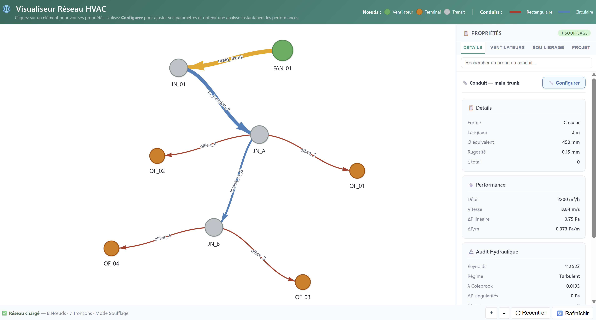
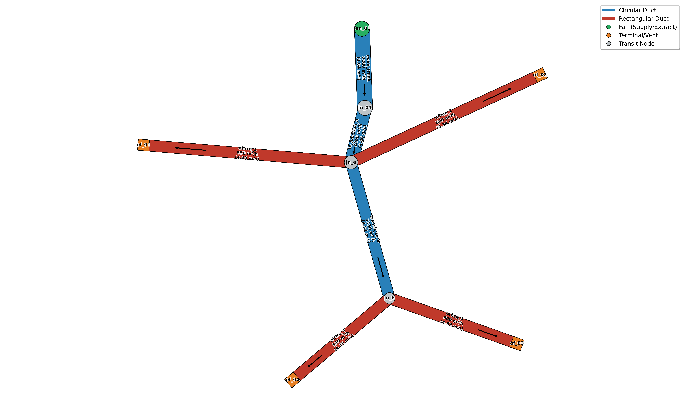

# HVAC Network Solver API

> **Moteur de calcul aéraulique haute performance** dédié au dimensionnement et à l'équilibrage dynamique de réseaux CVC complexes. Développé avec une architecture API-First (FastAPI), ce solveur automatise la résolution physique non linéaire pour garantir une précision industrielle et une efficience énergétique optimale.


---

## 🌐 Application en Ligne

L'API est déployée sur Render et accessible sans installation :

<p align="center">
  <a href="https://hvac-api-wtuu.onrender.com/docs" target="_blank">
    
  </a>
</p>

> ⚠️ *L'instance Render se met en veille après inactivité — prévoir ~30 secondes au premier chargement.*


---


## ✨ Fonctionnalités Clés
 
| Capacité | Détail |
|---|---|
| **Physique rigoureuse** | Darcy-Weisbach, Colebrook-White (bisection), Sutherland, Idelchik, Borda-Carnot, Bernoulli généralisé |
| **Solveur nodal non linéaire** | Équilibrage automatique des débits par l'approche de Gauss-Seidel avec facteur de relaxation adaptatif anti-oscillation |
| **Singularités avancées** | Tés dynamiques et transitions convergent/divergent détectés automatiquement selon le flux réel et activables indépendamment |
| **Précision industrielle** | Résidu $< 10^{-9}$ m³/s — conservation des masses stricte (Kirchhoff) |
| **Multi-ventilateurs** | Dimensionnement individuel par ventilateur, circuit critique par Dijkstra, table d'équilibrage par terminal |
| **Analyse acoustique** | Diagnostic adaptatif par type de conduit + recommandations de redimensionnement (ASHRAE) |
| **Analyse énergétique** | Puissance absorbée (méthodes B/C AMCA/Almeco) + OPEX annuel estimé |
| **Visualiseur interactif** | Exploration post-calcul via Vis-Network — 4 onglets (Détails/Ventilateurs/Équilibrage/Projet), mode édition par conduit avec recalcul instantané, réinitialisation indépendante par champ, reset conduit complet et reset global, soufflage et extraction, mono et multi-ventilateurs |
| **Intégration** | API REST scalable, export JSON structuré pour CAO, BIM, jumeaux numériques |
| **Rapports PDF** | Bilan aéraulique, audit hydraulique, analyse acoustique, schéma réseau — générés automatiquement |
| **Prédimensionnement** | Module autonome pour le calcul des gaines circulaires et rectangulaires selon débit et vitesse cible *(Voir [l'Annexe Technique](#annexe-02--assistant-de-prédimensionnement))* |


---

## 🔬  Moteur de Calcul — Vue d'Ensemble

Le solveur transforme la topologie physique du réseau en un système d'équations non linéaires, résolu itérativement jusqu'à l'équilibre parfait des flux.

> *La dérivation mathématique complète (formulation nodale, linéarisation de Taylor, méthode de Gauss-Seidel non linéaire, lien avec Hardy-Cross) est détaillée dans l'[Annexe Technique](#annexe-01--fondements-mathématiques).*

### Propriétés dynamiques de l'air
 
Les propriétés physiques sont recalculées en fonction des conditions réelles du site (température $T$, altitude $z$) :
 
$$\rho = \frac{P_{atm}(z)}{R_{air} \cdot T} \qquad et \qquad \mu = \mu_0 \left(\frac{T}{T_0}\right)^{3/2} \frac{T_0 + S}{T + S}$$
 
avec $P_{atm}(z) = 101325 \cdot (1 - 2.25577 \times 10^{-5} \cdot z)^{5.25588}$ — modèle ISA (valable jusqu'à 11 000 m).

### Pertes de charge
 
Les pertes sont calculées via **Darcy-Weisbach**, avec le coefficient de frottement $\lambda$ déterminé dynamiquement selon le régime :
 
$$\Delta P = \left( \lambda \cdot \frac{L}{D_h} + \Sigma\zeta \right) \cdot \frac{\rho \cdot v^2}{2}$$
 
- **Régime turbulent** : résolution numérique exacte de **Colebrook-White** $$({1}/{\sqrt{\lambda}} = -2 \log_{10} ({\varepsilon}/{(3.7 D_h)} + {2.51}/{(Re{\sqrt{\lambda}})}))$$ par bisection $(tolérance < 10^{-10})$
- **Régime laminaire** : formule analytique de **Poiseuille** $(\lambda = 64/Re)$

### Stratégie de convergence en deux phases
 
| Phase | Déclenchement | Contenu |
|---|---|---|
| **Phase 1** — Convergence primaire | Démarrage | Frottement linéaire + singularités constantes (coeffs déclarés) |
| **Phase 2** — Singularités dynamiques | $Imb < 10^{-3}$ m³/s | ζ tés et transitions **recalculés à chaque itération** sur débits stabilisés — activables indépendamment via `Calcul_Tees_Dynamiques` et `Calcul_Transitions_Dynamiques` |
| **Convergence finale** | $Imb < 10^{-9}$ m³/s | Arrêt — résidu ≈ 3.6 mL/h sur l'ensemble du réseau |
 
Cette stratégie en deux phases évite les oscillations dues aux ζ dynamiques calculés sur des débits encore instables.


### Singularités physiques

**Transitions Convergent/Divergent (Idelchik Ch.5)** — appliquées aux jonctions simples (2 conduits), sections réelles utilisées pour le ratio β (circulaire ou rectangulaire). Convention : `slope_degrees` = angle total du cône (ex: 30° → demi-angle Idelchik α = 15°). Seuil élargissement brusque : α ≥ 40° (Borda-Carnot exact).
- **Convergent** : $\zeta = \zeta_{fr} + \zeta_{loc}$ (Idelchik 5.6 + 5.23)
- **Divergent** : $\zeta = k(\alpha) \cdot (1-\beta)^2$ avec $k$ interpolé Idelchik/Miller

**Tés Dynamiques (Idelchik Ch.7)** — détection locale division/confluence selon direction réelle du flux. Les ζ sont indexés sur la vitesse du tronc commun puis convertis via (v_commun/v_local)² :
- **Division** : $\zeta_b = 1 + v_r^2 - 2x$ ; $\zeta_s = 1-(1-x)^2-0.8x^2$ (Idelchik 7-22)
- **Confluence** : $\zeta_b = 1 + v_r^2 - 2(1-x)$ ; $\zeta_s = 0.9(1-x)^2$ (Idelchik 7-29)

Les ζ sont convertis depuis la vitesse du tronc commun vers la vitesse locale de chaque conduit via le rapport $\left(\frac{v_{commun}}{v_{local}}\right)^2$. Les **ζ négatifs** (gain d'inertie) sont isolés et appliqués en post-traitement sans déstabiliser le solveur.

### Dimensionnement multi-ventilateurs
 
L'algorithme de **Dijkstra** identifie le circuit critique de chaque ventilateur. La pression et la puissance sont calculées individuellement :
 
$$\Delta P_{ventilateur} = \sum \Delta P_{pertes} \qquad , \qquad \dot{W}_{ventilateur,i} = \frac{\Delta P_{tot,i} \cdot Q_i}{\eta_i} \qquad et \qquad \dot{W}_{total} = \sum_i \dot{W}_{ventilateur,i}$$

Le coût annuel estimé est dérivé du temps de service annuel ($T_{annuel}$ en heures) et du coût unitaire de l'énergie ($C_{kWh}$) :

$$OPEX = \dot{W}_{total} \cdot T_{annuel} \cdot C_{kWh} \cdot 10^{-3}$$

### Analyse acoustique
 
L'évaluation du niveau de puissance acoustique régénérée ($L_w$) s'appuie sur la méthodologie **ASHRAE**. Le modèle corrèle le niveau sonore à la vitesse de l'air ($v$) et à la section transversale du conduit ($A$) selon la relation empirique suivante :
 
$$L_w \approx 10 + 50\log_{10}(|v|) + 10\log_{10}(A)$$
 
Le solveur classe chaque conduit (Terminal / Intermédiaire / Principal), applique des seuils différenciés et propose des dimensions optimales en cas de dépassement critique.

---

## 🔌 Endpoints de l'API
L'API est structurée autour des endpoints suivants pour piloter le solveur, de la configuration du réseau jusqu'à l'export des résultats :

| Méthode | Route | Description | Format |
| :--- | :--- | :--- | :--- |
| `GET` | `/system/info` | Diagnostic du système | JSON |
| `POST` | `/network/reset` | Réinitialisation du moteur | JSON |
| `POST` | `/project/info` | Métadonnées projet | JSON |
| `POST` | `/network/import-project` | **Import global** (nœuds + conduits + ventilateurs) | JSON |
| `POST` | `/network/nodes` | Configuration des nœuds | JSON |
| `POST` | `/network/ducts` | Définition des conduits | JSON |
| `POST` | `/network/fans` | Configuration des ventilateurs | JSON |
| `POST` | `/network/calculate` | **Solveur** — calcul complet avec contrôle indépendant de paramètres de simulation | JSON |
| `GET` | `/network/visualizer` | **Visualiseur interactif** — Exploration et modification post-calcul | HTML |
| `GET` | `/network/data` | Export données | JSON |
| `GET` | `/network/schema` | Schéma du réseau | PNG |
| `GET` | `/network/report` | Rapport technique complet | PDF |
| `GET` | `/catalog/zeta` | Catalogue des coefficients singuliers | JSON |
| `POST` | `/tools/duct-sizer` | Prédimensionnement des conduits | JSON |

---

## 🏗️ Tutoriel Rapide

Accédez à **[https://hvac-api-wtuu.onrender.com/docs](https://hvac-api-wtuu.onrender.com/docs)** et suivez ces étapes dans l'interface Swagger :

### Étape 1 — Reset
`POST /network/reset` — Purgez le moteur avant chaque nouvelle simulation.

### Étape 2 — Informations Projet *(optionnel)*
`POST /project/info` — Définissez les métadonnées pour les rapports.
Nom du projet : Batiment_R+4 | Client : Promoteur_X | Site : Lyon_69

### Étape 3 — Import du réseau
`POST /network/import-project` — Configurez nœuds, conduits et ventilateurs en un seul appel :

```json
{
  "nodes": [
    { "name": "FAN_01", "supply": 2200.0 },
    { "name": "JN_01", "supply": 0.0 },
    { "name": "JN_A", "supply": 0.0 },
    { "name": "OF_01", "supply": -550.0 },
    { "name": "OF_02", "supply": -500.0 },
    { "name": "JN_B", "supply": 0.0 },
    { "name": "OF_03", "supply": -600.0 },
    { "name": "OF_04", "supply": -550.0 }
  ],
  "edges": [
    { "name": "main_trunk", "n1": "FAN_01", "n2": "JN_01", "L": 2.0, "D": 0.45, "epsilon": 0.15, "coeffs": [0, ""], "is_branch": false },
    { "name": "to_junction_A", "n1": "JN_01", "n2": "JN_A", "L": 3.0, "D": 0.40, "epsilon": 0.15, "coeffs": [0, ""], "slope_degrees": 30, "is_branch": false },
    { "name": "office_1", "n1": "JN_A", "n2": "OF_01", "L": 2.0, "W": 0.2, "H": 0.17, "epsilon": 0.02, "coeffs": ["sortie_diffuseur_libre"], "is_branch": true },
    { "name": "office_2", "n1": "JN_A", "n2": "OF_02", "L": 2.0, "W": 0.2, "H": 0.16, "epsilon": 0.02, "coeffs": ["sortie_diffuseur_libre"], "is_branch": true },
    { "name": "transit_to_B", "n1": "JN_A", "n2": "JN_B", "L": 3.0, "D": 0.30, "epsilon": 0.15, "coeffs": [0, ""], "is_branch": false },
    { "name": "office_3", "n1": "JN_B", "n2": "OF_03", "L": 2.0, "W": 0.2, "H": 0.18, "epsilon": 0.02, "coeffs": ["sortie_diffuseur_libre"], "is_branch": true },
    { "name": "office_4", "n1": "JN_B", "n2": "OF_04", "L": 2.0, "W": 0.2, "H": 0.17, "epsilon": 0.02, "coeffs": [ "sortie_diffuseur_libre"], "is_branch": true }
  ],
  "fans": [
    { "name": "Main_Fan", "node_name": "FAN_01", "rendement": 0.75, "description": "Fresh air supply" }
  ]
}
```

> * **Convention nœuds ventilateurs** : Le moteur identifie automatiquement les nœuds ventilateurs par le préfixe `fan_` (ex: `fan_1`, `fan_principal`).
> * **Catalogue de singularités (ζ)** : Vous pouvez soit utiliser les clés prédéfinies disponibles via `GET /catalog/zeta`, soit renseigner directement les coefficients de perte de charge ζ pour chaque conduit.

### Étape 4 — Calcul
`POST /network/calculate` — Lancez le solveur. Ajustez température et altitude pour affiner les propriétés de l'air (ex. 20°C, 170 m pour Lyon).

### Étape 5 — Visualiseur interactif & Exports

**Visualiseur interactif (`GET /network/visualizer`) — Exploration et modification post-calcul :**

<p align="center">
  
</p>

Interface web complète basée sur Vis-Network. Quatre onglets : **Détails**, **Ventilateurs**, **Équilibrage** (K-Factor par terminal), **Projet** (métadonnées + conditions de calcul). Cliquez sur un conduit pour inspecter ses propriétés ou basculer en **mode édition** — modifiez Ø, L, rugosité ou coefficients ζ et cliquez **▶ Calculer** pour un recalcul instantané. Boutons ↺ individuels pour réinitialiser chaque paramètre indépendamment, **↺ Reset conduit** pour restaurer l'ensemble du conduit, et **↺ Tout réinitialiser** pour restaurer tous les conduits à leurs valeurs initiales de simulation. Fonctionne en soufflage et extraction, mono et multi-ventilateurs.

**Données JSON** (`GET /network/data`) — Export structuré pour intégration CAO/BIM :

📎 [Exemple de rapport JSON](docs/Batiment_R+4_Promoteur_X_20260610_180036.json)


**Schéma réseau** (`GET /network/schema`) :

<p align="center">
  
</p>

**Rapport PDF** (`GET /network/report`) — Audit hydraulique, pressions, acoustique, schéma :

📎 [Exemple de rapport PDF](docs/Batiment_R+4_Promoteur_X_20260610_180036.pdf)


---

## 🛠️ Déploiement Local

```bash
# Cloner ce dépôt
git clone https://github.com/FatehChaabat/hvac-network-solver.git
cd hvac-network-solver

# Installer la dépendance nécessaire
pip install requests

# Lancer la démonstration complète
python quick_start.py
```

> 💡 Ce dépôt est une interface de documentation et de démonstration. Le moteur de calcul propriétaire est hébergé dans un dépôt privé, synchronisé via un pipeline CI/CD sur Render.

---

## 📁 Structure du Dépôt

```text
hvac-network-solver/
│
├── README.md                                             # Documentation & exemples
├── LICENSE                                               # Licence MIT
├── quick_start.py                                        # Script de démarrage rapide
│
├── docs/
|   ├── visualizer_demo.png                               # Capture d'écran visualiseur interactif
│   ├── Batiment_R+4_Promoteur_X_20260610_180036.json     # Rapport JSON exemple
│   ├── Batiment_R+4_Promoteur_X_20260610_180036.png      # Schéma réseau exemple
│   └── Batiment_R+4_Promoteur_X_20260610_180036.pdf      # Rapport PDF exemple
│
└── .gitignore                                            # Fichiers exclus du dépôt
```

---

## 👤 Auteur
Ingénieur en mécanique des fluides et énergétique, spécialisé en modélisation et systèmes CVC.

[](https://fatehchaabat.github.io)
[](https://www.linkedin.com/in/fateh-chaabat-08202aa9/)
[](https://github.com/FatehChaabat)
[](https://www.researchgate.net/profile/Fateh-Chaabat-2)

---

## 📄 Licence
Ce projet est distribué sous licence **MIT**. Voir le fichier [LICENSE](LICENSE) pour plus de détails.

<br> <br>

---

<h2 align="center">ANNEXE 01 — Fondements Mathématiques</h2>

<a name="annexe-01--fondements-mathématiques"></a>

> *Cette annexe s'adresse aux ingénieurs et chercheurs souhaitant comprendre les bases théoriques du solveur. Elle détaille la dérivation rigoureuse de l'algorithme de résolution.*

## 1. Formulation du Problème

### 1.1 Variables et Inconnues

Le réseau aéraulique est modélisé comme un graphe orienté $\mathcal{G} = (\mathcal{N}, \mathcal{D})$ où :
- $\mathcal{N}$ : ensemble des **nœuds** (jonctions, ventilateurs, bouches)
- $\mathcal{D}$ : ensemble des **conduits** (arêtes orientées)

**Inconnues** : le vecteur des pressions nodales $\mathbf{P} = \{P_n\}_{n \in \mathcal{N}}$

**Données** : les débits imposés $S_n$ à chaque nœud (soufflage si $S_n > 0$, extraction si $S_n < 0$, transit si $S_n = 0$) 

---

### 1.2 Loi de Conservation de la Masse (Kirchhoff)

Pour chaque nœud $n$, la conservation de la masse impose l'annulation de l'**imbalance** :

$$Imb_n(\mathbf{P}) = S_n + \sum_{d \in \mathcal{D}(n)} Q_d(\mathbf{P}) = 0 \qquad \forall n \in \mathcal{N}$$

où $\mathcal{D}(n)$ désigne l'ensemble des conduits connectés au nœud $n$, avec la convention :
- $Q_d > 0$ : flux **entrant** au nœud $n$
- $Q_d < 0$ : flux **sortant** du nœud $n$

Ce système constitue un **système d'équations non linéaires** $F(\mathbf{P}) = \mathbf{0}$ de taille $N \times N$.

---

### 1.3 Relation Débit–Pression (Darcy-Weisbach)

La relation entre le débit $Q_d$ et la différence de pression $\Delta P_d = P_{n_1} - P_{n_2}$ dans un conduit $d$ est :

$$Q_d = \text{sign}(\Delta P_d) \cdot \sqrt{\frac{|\Delta P_d|}{R_d}}$$

avec la **résistance aéraulique** :

$$R_d = \left(\lambda_d \cdot \frac{L_d}{D_{h,d}} + \Sigma\zeta_d\right) \cdot \frac{\rho}{2A_d^2}$$

La **non-linéarité** provient de la dépendance de $\lambda_d$ au nombre de Reynolds (lui-même fonction de $Q_d$), et de la racine carrée dans la relation $Q_d(\Delta P_d)$.

---

## 2. Dérivation de l'Algorithme de Résolution

### 2.1 Linéarisation Locale par Développement de Taylor

Pour annuler $Imb_n$, on cherche la correction $\delta P_n$ telle que :

$$Imb_n(P_n + \delta P_n) \approx 0$$

Le développement de Taylor au **premier ordre** donne :

$$Imb_n(\mathbf{P}) + \frac{\partial Imb_n}{\partial P_n} \cdot \delta P_n + \mathcal{O}(\delta P_n^2) = 0$$

En négligeant les termes d'ordre supérieur :

$$\delta P_n = -\frac{Imb_n(\mathbf{P})}{\dfrac{\partial Imb_n}{\partial P_n}}$$

---

### 2.2 Calcul de la Dérivée Locale

$$\frac{\partial Imb_n}{\partial P_n} = \sum_{d \in \mathcal{D}(n)} \frac{\partial Q_d}{\partial P_n}$$

Pour un conduit $d$ connecté au nœud $n$, on a $Q_d = \text{sign}(\Delta P_d) \cdot \sqrt{|\Delta P_d| / R_d}$, donc :

$$\frac{\partial Q_d}{\partial \Delta P_d} = \frac{1}{2\sqrt{|\Delta P_d| \cdot R_d}}$$

En introduisant la **conductance aéraulique** $C_d = 1/\sqrt{R_d}$ :

$$\frac{\partial Q_d}{\partial \Delta P_d} = \frac{C_d}{2\sqrt{|\Delta P_d|}} = \frac{0.5 \cdot C_d}{\sqrt{|\Delta P_d|}}$$

D'où la **dérivée locale totale** au nœud $n$ :

$$\frac{\partial Imb_n}{\partial P_n} = \sum_{d \in \mathcal{D}(n)} \frac{0.5 \cdot C_d}{\sqrt{|\Delta P_d|}}$$

---

### 2.3 Équation de Correction — Résultat Final

En substituant dans l'expression de $\delta P_n$ et en introduisant le **facteur de relaxation** $\omega$ :

$$\boxed{P_{n}^{(k+1)} = P_{n}^{(k)} + \omega \cdot \frac{Imb_n^{(k)}}{\displaystyle\sum_{d \in \mathcal{D}(n)} \dfrac{0.5 \cdot C_d}{\sqrt{|\Delta P_d^{(k)}|}}}}$$

> **Note sur le signe :** Par convention, $Imb_n > 0$ indique un excès de débit entrant au nœud $n$.
> Une augmentation de $P_n$ repousse le flux vers les nœuds adjacents, ce qui réduit l'imbalance — d'où le signe $+$.

---

## 3. Classification de la Méthode

### 3.1 Gauss-Seidel Non Linéaire

Cette méthode appartient à la famille des **méthodes de Gauss-Seidel non linéaires** :
- Les pressions sont mises à jour **nœud par nœud** (séquentiellement)
- Chaque correction utilise les valeurs **les plus récentes** des pressions voisines
- Seule la **dérivée diagonale** $\partial Imb_n / \partial P_n$ est utilisée — pas le Jacobien complet

**Comparaison avec Newton-Raphson global :**

| Critère | Newton-Raphson Global | Gauss-Seidel Non Linéaire |
|---|---|---|
| Jacobien | Matrice complète $J \in \mathbb{R}^{N \times N}$ | Diagonale uniquement |
| Résolution | Système linéaire $J \cdot \Delta\mathbf{P} = -F$ | Correction scalaire par nœud |
| Convergence | Quadratique | Linéaire |
| Stabilité | Sensible à l'initialisation | Robuste avec $\omega$ adaptatif |
| Complexité | $\mathcal{O}(N^3)$ par itération | $\mathcal{O}(N \cdot d_{max})$ par itération |

### 3.2 Lien avec la Méthode de Hardy-Cross

Dans la littérature des **réseaux hydrauliques**, cette approche est connue sous le nom de **méthode de Hardy-Cross** (1936). Le solveur en constitue une généralisation :
- Support des **topologies arbitraires** (arborescentes, maillées, multi-sources)
- Gestion native du **soufflage et de l'extraction**
- Résistances $R_d$ **recalculées dynamiquement** à chaque itération (dépendance au Reynolds)

---

## 4. Stratégie de Relaxation Adaptative

### 4.1 Rôle du Facteur $\omega$

Sans relaxation ($\omega = 1$), la correction peut être excessive → **oscillations** → **divergence**.

Le facteur $\omega \in [0.02,\ 0.3]$ est ajusté **dynamiquement** à chaque itération :

$$\omega^{(k+1)} = \begin{cases} 
\max\left(0.95 \cdot \omega^{(k)},\ 0.02\right) & \text{si stagnation } (Imb^{(k)} \geq Imb^{(k-1)}) \\ 
\min\left(1.05 \cdot \omega^{(k)},\ 0.3\right) & \text{si progression } (k \equiv 0 \pmod{50}) 
\end{cases}$$

### 4.2 Stratégie de Convergence en Deux Phases

$$
\begin{aligned}
&\text{Phase 1 :} \quad Imb_{max} \longrightarrow 10^{-3} \ \mathrm{m^3/s} \quad &&(\text{frottement pur + singularités constantes}) \\
&\text{Phase 2 :} \quad Imb_{max} \longrightarrow 10^{-9} \ \mathrm{m^3/s} \quad &&(\text{+ singularités dynamiques})
\end{aligned}
$$


Cette stratégie évite les **oscillations précoces** dues aux ζ dynamiques (tés, transitions) calculés sur des débits encore instables.

---

## 5. Convergence et Complexité

### 5.1 Critère d'Arrêt

$$Imb_{max}^{(k)} = \max_{n \in \mathcal{N}} \left| Imb_n^{(k)} \right| < 10^{-9} \text{ m}^3/\text{s}$$

Ce seuil correspond à **3.6 mL/h** d'écart sur l'ensemble du réseau — précision largement suffisante pour toute application HVAC industrielle.

### 5.2 Complexité par Itération

$$\mathcal{O}(N \cdot d_{max} + |\mathcal{D}|)$$

où $d_{max}$ est le degré maximal des nœuds — typiquement 3 ou 4 pour les tés et croix. La complexité est donc **linéaire** en la taille du réseau, ce qui garantit des temps de calcul très faibles même sur des topologies complexes.

---

## 6. Références

| Référence | Domaine |
|---|---|
| Hardy Cross (1936) — *Analysis of flow in networks of conduits or conductors* | Méthode originale |
| Idelchik — *Handbook of Hydraulic Resistance* (Ch.5, Ch.7) | Singularités aérauliques |
| Colebrook & White (1937) | Friction turbulente |
| Darcy-Weisbach | Pertes de charge linéaires |
| Sutherland (1893) | Viscosité dynamique de l'air |
| AMCA/Almeco — Méthodes B & C | Dimensionnement ventilateur |


<br><br>

---

<h2 align="center">ANNEXE 02 — Assistant de Prédimensionnement</h2>
 
<a name="annexe-02--assistant-de-prédimensionnement"></a> 
## `POST /tools/duct-sizer`

Calcul autonome des dimensions optimales de gaines à partir du **débit** et d'une **vitesse cible**, pour maîtriser le confort acoustique et limiter les bruits de régénération.

### Conduit circulaire
 
```
POST /tools/duct-sizer?q=1200&v=4.5&shape=circular
```
 
```json
{
  "status": "success",
  "type": "Preliminary Sizing Assistant",
  "results": {
    "shape": "circular",
    "suggested_diameter_mm": 307,
    "section_m2": 0.0741,
    "target_velocity_ms": 4.5,
    "note": "Design optimized for acoustic comfort"
  }
}
```
 
### Conduit rectangulaire
 
```
POST /tools/duct-sizer?q=1200&v=4.5&shape=rectangular
```
 
```json
{
  "status": "success",
  "type": "Preliminary Sizing Assistant",
  "results": {
    "shape": "rectangular",
    "suggested_W_mm": 333,
    "suggested_H_mm": 222,
    "section_m2": 0.0741,
    "aspect_ratio": "1.5",
    "target_velocity_ms": 4.5,
    "note": "Design optimized for acoustic comfort"
  }
}
```
